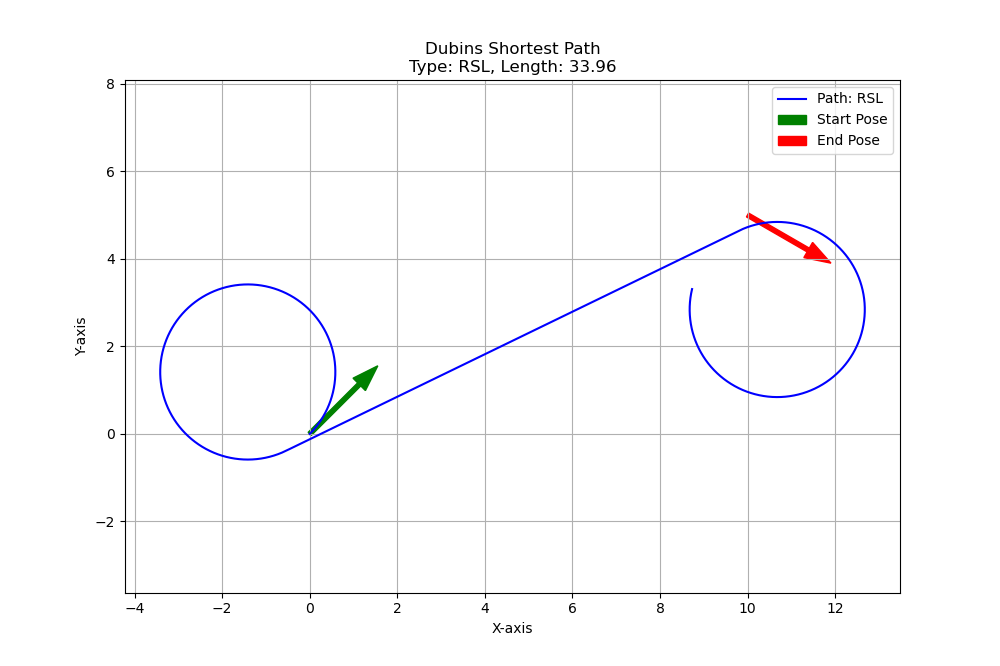

# sub-Riemann幾何学に基づくDubins carの最短経路計画

## 1. プロジェクト概要
(このプロジェクトが何であるかを1〜2文で説明)

## 2. 背景：なぜ力任せの探索ではダメなのか？
(A*などの探索アルゴリズムの問題点（次元の呪い）について簡潔に記述)

## 3. 理論：なぜ解析解が可能なのか？ (あなたのショーケース)
(この問題がサブリーマン幾何学の測地線問題として定式化できること、PMPとハミルトン方程式、そして「解の構造がCとSの組み合わせになる」という結論までの流れを記述)
配位空間$Q = \mathbf{R}^{2} \times S^{1}$
$$
    \begin{bmatrix}
        \dot{x} \\
        \dot{y} \\
        \dot{\theta}
    \end{bmatrix}
    =
    \begin{bmatrix}
        v\cos\theta \\
        v\sin\theta \\
        u
    \end{bmatrix}
    .
$$

## 4. アルゴリズム
(理論に基づき、6つの経路候補パターン（RSLなど）を幾何学的に計算し、最短なものを選択するアプローチを取ったことを説明)

## 5. シミュレーション結果
(このセクションは、後でシミュレーションが完成してから執筆。ここに結果の画像を貼り付ける)
以下は、本アルゴリズムによって計算された最短経路の一例です。
スタート地点（緑矢印）とゴール地点（赤矢印）の姿勢を、指定された回転半径の制約下で、滑らかに結ぶ経路が生成されていることが確認できます。



## 6. 実行方法
(必要なライブラリ（numpy, matplotlib）と、プログラムの実行コマンドを記述)
```
python src/main.py
```
